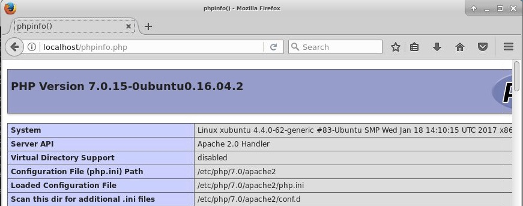
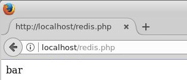
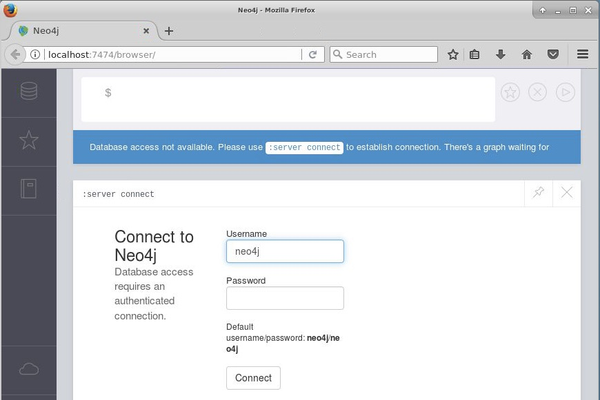

# Configuración del entorno de la asignatura

En la asignatura usaremos una máquina virtual inicializada con Linux 16.04 LTS (Usaremos un Linux Desktop, preferiblemente XUbuntu). Aquí veremos cómo instalar los componentes siguientes:

* [LAMP](#lamp)
* [Git](#git)
* [Redis](#redis)
* [MongoDB](#mongodb)
* [Neo4j](#neo4j)
* [Otros](#otros)

## Configuración inicial

Antes de nada, actualizaremos nuestro sistema 

```
sudo apt-get update
sudo apt-get upgrade
```

Si durante el proceso, el sistema nos pregunta si deseamos actualizar el archivo de `sudoers` contestaremos que no, que es la opción predetermianda

````
Configuration file '/etc/sudoers'
 ==> Modified (by you or by a script) since installation.
 ==> Package distributor has shipped an updated version.
   What would you like to do about it ?  Your options are:
    Y or I  : install the package maintainer's version
    N or O  : keep your currently-installed version
      D     : show the differences between the versions
      Z     : start a shell to examine the situation
 The default action is to keep your current version.
*** sudoers (Y/I/N/O/D/Z) [default=N] ? N
````

## LAMP
___

La información para instalar un entorno LAMP con Apache, MySQL y PHP ha sido extraída del [Tutorial de Unixmen para instalar un stack LAMP](https://www.unixmen.com/how-to-install-lamp-stack-on-ubuntu-16-04/)

### Instalación de Apache

```
sudo apt-get install -y apache2
```

Ya tenemos instalado Apache. La carpeta raíz de publicación predeterminada donde tendremos que colocar nuestros proyectos web es `/var/www/html`. Para modificar este valor hay que cambiar el valor de la propiedad `DocumentRoot` al valor deseado en el archivo de configuración `/etc/apache2/sites-available/000-default.conf`.

### Instalación de MySQL 

Instalaremos el servidor de MySQL y los paquetes necesarios para que los scripts PHP puedan conectarse a bases de datos MySQL. En la instalación de MySQL nos pedirá una contraseña para el usuario `root`. Es importante la contraseña que introduzcamos porque habrá que recordarla más adelante.


```
sudo apt-get install -y mysql-server php-mysql
```

Es conveniente hacer que nuestra instalación de MySQL sea más segura. En concreto podremos establecer una contraseña para las cuentas de `root`, eliminar las cuentas `root`que sean accesibles desde fuera de `localhost`, eliminar las cuentas de usuarios anónimos, eliminar la base de datos `test` (que de forma predeterminada puede ser accedida por todos los usuarios, incluidos los anónimos), y los privilegios que permiten a cualquier usuario acceder a bases de datos que comiencen por `test_`.

```
sudo /usr/bin/mysql_secure_installation
```

### Instalación de PHP

Instalaremos los paquetes de PHP, el módulo PHP para el servidor Apache y la extensión de cifrado.

```
sudo apt-get install -y php libapache2-mod-php php-mcrypt
```

A continuación, modificaremos el archivo `/etc/apache2/mods-enabled/dir.conf` para que priorizar la carga de archivos `.php` respecto a los `.html`. Eso lo haremos colocando `index.php` antes que `index.html`.

```
<IfModule mod_dir.c>
  DirectoryIndex index.php index.html index.cgi index.pl index.xhtml index.htm
</IfModule>" 
```

Cuando más adelante creemos un proyecto PHP usando el framework [Phalcon](http://phalconphp.com/), crearemos un archivo `.htaccess`. Para que sea efectivo lo definido en `.htaccess` tenemos que cambiar el valor de `AllowOverride` en el archivo `/etc/apache2/apache2.conf` El valor que debe tomar es `AllowOverride All`

```
<Directory /var/www/>
        Options Indexes FollowSymLinks
        AllowOverride All
        Require all granted
</Directory>
```
También necesitaremos reescribir URLs sobre la marcha. Esto lo conseguiremos instalando el módulo `mod_rewrite` de Apache.

```
sudo a2enmod rewrite
```

Por último, reiniciaremos el servidor Apache para que se hagan efectivos los cambios que hemos realizado.

```
sudo service apache2 restart
```

Para probar el funcionamiento de PHP y Apache crearemos un script de prueba

```
sudo nano /var/www/html/phpinfo.php
<?php
	phpinfo();
?>
```

Ahora lo cargamos con `http://localhost/phpinfo.php` y obtendremos la información de configuración de nuestro entorno.




## Git
___

[Git](http://git-scm.com/) es un popular Sistema de control de versiones distribuido open source. Lo instalaremos en nuestro equipo con 

```
sudo apt-get install -y git
```

## Redis
___

[Redis](http://redis.io/) es una base de datos NoSQL que pertenece a la familia de las Bases de datos clave-valor.

Su instalación es muy sencilla. Simplemente, tenemos que descargar, descomprimir y compilar.

```
wget http://download.redis.io/redis-stable.tar.gz
tar xvzf redis-stable.tar.gz
rm -rf redis-stable.tar.gz
cd redis-stable
make
```

A continuación instalaremos Redis en nuestra máquina 

```
sudo make install
```

Iniciar el servidor Redis

```
src/redis-server
```

En una nueva ventana comprobaremos el funcionamiento correcto del servidor Redis con `src/redis-cli ping`. Esto nos devolverá `PONG` indicando el correcto funciomiento de Redis.

El cliente Redis lo cargaremos con 

```
src/redis-cli
```

### Instalación de PhpRedis

PhpRedis es el driver que utilizaremos para interactuar con Redis desde PHP. La extensión de este driver está disponible para Linux en forma de código fuente, por lo que tendremos que descargarlo y compilarlo.

Antes de descargar el código fuente de PhpRedis instalaremos el paquete `php-dev`. Este paquete es necesario para compilar módulos PHP adicionales a partir de código fuente.

```
sudo apt-get install -y php-dev
```

El código fuente del driver lo descargaremos a partir del [repositorio GitHub de PhpRedis](https://github.com/phpredis/phpredis)

```
cd ~
git clone https://github.com/phpredis/phpredis
```

Una vez descargado, compilaremos el código de PhpRedis

```
cd phpredis

phpize
./configure
make
sudo make install
```

Tras el proceso de instalación, se nos informará en qué carpeta se ha instalado la extensión. La carpeta de instalación de la extensión se situará debajo de `/usr/lib/php/`. En mi caso la extensión se ha instalado en `/usr/lib/php/20151012`.

A continuación hay que modificar el archivo `php.ini` para indicar que cargue la extensión de PhpRedis (`redis.so`). `php.ini` se encuentra en `/etc/php/7.0/apache2/php.ini`. Tendrás que añadir lo siguiente en la zona de extensiones.

```
extension=redis.so
```

Ahora, reiniciaremos el servidor Apache para que tengan efecto los cambios

```
sudo service apache2 restart
```

El código fuente de PhpRedis ya no lo necesitamos, por lo que lo podemos borrar. Nos situaremos sobre su carpeta superior y lo eliminaremos con 

```
cd ~
rm -rf phpredis
```

Podemos comprobar que la extensión de PhpRedis ya está instalada en nuestro sistema con `phpinfo.php`.


Para probar el funcionamiento del PhpRedis con Redis crearemos un script de prueba `redis.php` con los parámetros de conexión predeterminados. El script creará el valor `bar` en la clave `foo`. Recuerda que debes tener arrancado el servidor Redis.

```
sudo nano /var/www/html/redis.php
<?php
	$redis = new Redis();
	$redis->connect("localhost");
	$redis->set("foo", "bar");
	echo $redis->get("foo");
?>
```



### Instalación del framework Phalcon

[Phalcon](http://phalconphp.com) es un framework para PHP que se cargará como una extensión PHP en `php.ini`. 

En primer lugar, descargaremos e instalaremos Phalcon

```
curl -s "https://packagecloud.io/install/repositories/phalcon/stable/script.deb.sh" | sudo bash

sudo apt-get install php7.0-phalcon
```

A contunuación hay que modificar el archivo `php.ini` para indicar que cargue la extensión de Phalcon (`phalcon.so`). `php.ini` se encuentra en `/etc/php/7.0/apache2/php.ini`. Tendremos que añadir la línea siguiente en la zona de extensiones.

```
extension=phalcon.so
```

Ahora, reiniciaremos el servidor Apache para que tengan efecto los cambios

```
sudo service apache2 restart
```

Podemos comprobar con `phpinfo.php` que la extensión Phalcon ya está instalada en nuestro sistema


## MongoDB
___

[MongoDB](https://www.mongodb.org/) es una base de datos NoSQL que pertenece a la familia de las Bases de datos de documentos.

Su instalación es muy sencilla. Simplemente, tenemos que descargarla. No obstante, antes de su descarga hay que seguir dos pasos:

* Importar la clave pública usada por el sistema de gestión de paquetes para asegurar la consistencia y autenticidad de los paquetes.
* Crear un *list file* para MongoDB

```
sudo apt-key adv --keyserver hkp://keyserver.ubuntu.com:80 --recv 0C49F3730359A14518585931BC711F9BA15703C6

echo "deb [ arch=amd64,arm64 ] http://repo.mongodb.org/apt/ubuntu xenial/mongodb-org/3.4 multiverse" | sudo tee /etc/apt/sources.list.d/mongodb-org-3.4.list

sudo apt-get update
sudo apt-get install -y mongodb-org
```

Ya tenemos instalado MongoDB. Para iniciar el servidor

```
sudo service mongod start
```

Para comprobar el *log* y ver si el proceso `mongod` está ejecutándose

```
cat /var/log/mongodb/mongod.log
```

Inciamos la shell de MongoDB con

```
mongo
```

Para detener MongoDB

```
sudo service mongod stop
```

Para reiniciar MongoDB

```
sudo service mongod restart
```

## Neo4j
___

[Neo4j](http://neo4j.com/) es una base de datos NoSQL que pertenece a la familia de las Bases de datos orientadas a grafos.

Su instalación es muy sencilla. Simplemente, tenemos que descargarla y añadir los repositorios Debian para Neo4j. No obstante, necesita que esté instalado JDK 8, ya sea el Oracle JDK 8 o el Open JDK 8.

La descarga e instalación se realiza con los comandos siguientes

```
cd ~

wget -O - https://debian.neo4j.org/neotechnology.gpg.key | sudo apt-key add -
echo 'deb https://debian.neo4j.org/repo stable/' | sudo tee /etc/apt/sources.list.d/neo4j.list
sudo apt-get update


sudo apt-get install neo4j
```

Para la instalación de JDK 8 usaremos el comando

```
sudo apt-get install -y openjdk-8-jdk 
```

Para lanzar Neo4j escribiremos

```
neo4j console
```

Con esto, ya tendremos un cliente disponible en `http://localhost:7474`



Los comandos básicos del servidor son:

* `start`: Iniciar el servidor como daemon, ejecutándose como un proceso en background
* `stop`: Detener un servidor iniciado como daemon
* `restart`: Reiniciar el servidor
* `status`: Obtener el estado actual del servidor
* `info`: Obtener información de configuración como el `$NEO4J_HOME` actual y `CLASSPATH`

## Otros
___


### Modificación de permisos

Puedes cambiar los permisos de la carpeta de publicación de Apache para no tener que crear siempre los archivos con `sudo`. 

> **Atención**
> 
> En este tutorial se particulariza para el usuario `clouduser`. Este usuario deberá ser sustituido por el usuario concreto al que se quiere añadir al grupo `www-data` y al que ser quiere hacer propietario de la carpeta `/var/www`.

```
sudo chgrp -R www-data /var/www
sudo chmod -R 775 /var/www
sudo chmod -R g+s /var/www
sudo useradd -G www-data clouduser
sudo chown -R clouduser /var/www/
```

### Composer 

Para algún proyecto PHP puede que necesites [Composer](https://getcomposer.org/), un gestor de dependencias para PHP.

Antes de comenzar con la instalación de _Composer_ deber saber que el proceso de instalación utiliza la signatura SHA-384 del instalador, **la cual varía de una version a otra**. La signatura SHA-384 para la versión de Composer instalada en el momento de la creación de este tutorial (_Composer 1.4.1_) era la siguiente.

**Signatura SHA-384 de _Composer 1.4.1_** 

```
669656bab3166a7aff8a7506b8cb2d1c292f042046c5a994c43155c0be6190fa0355160742ab2e1c88d40d5be660b410
```

Para instalar _Composer_, simplemente escribe estos comandos cambiando la signatura SHA-384 por la signatura correspondiente. 

```
php -r "copy('https://getcomposer.org/installer', 'composer-setup.php');"
php -r "if (hash_file('SHA384', 'composer-setup.php') === '669656bab3166a7aff8a7506b8cb2d1c292f042046c5a994c43155c0be6190fa0355160742ab2e1c88d40d5be660b410') { echo 'Installer verified'; } else { echo 'Installer corrupt'; unlink('composer-setup.php'); } echo PHP_EOL;"
php composer-setup.php
php -r "unlink('composer-setup.php');"
```

> **Información**
> 
> * [Signatura SHA-864](https://composer.github.io/pubkeys.html) para la versión actual de _Composer_.
> * [Pasos de instalación](https://getcomposer.org/download/) para la versión actual de _Composer_    