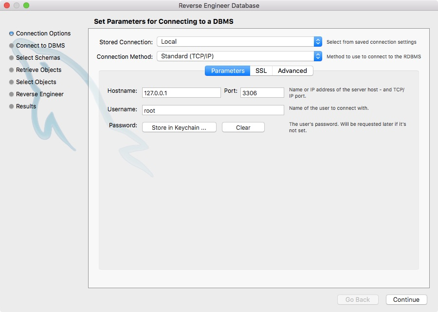
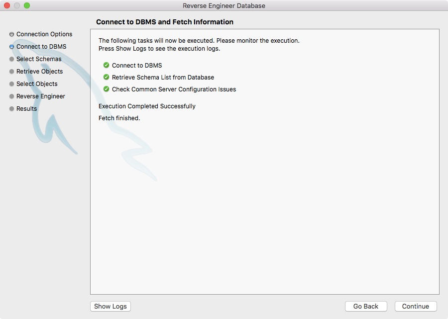
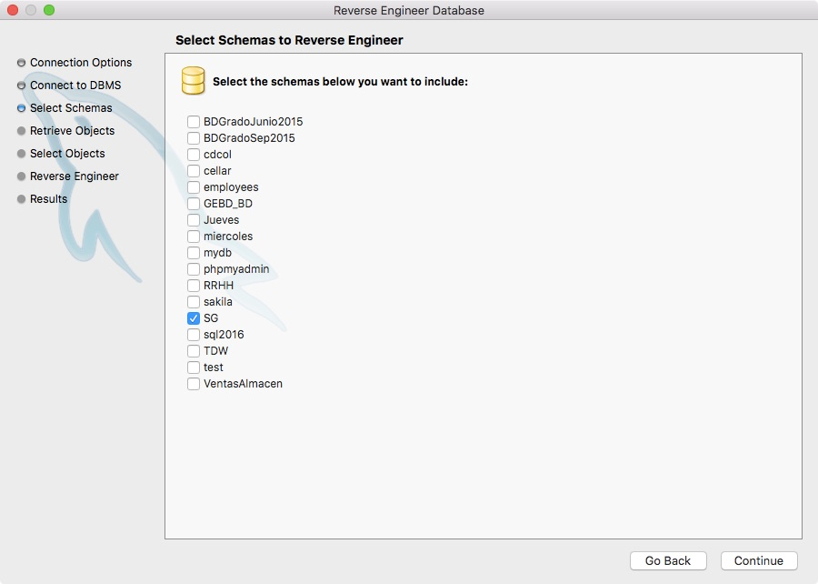
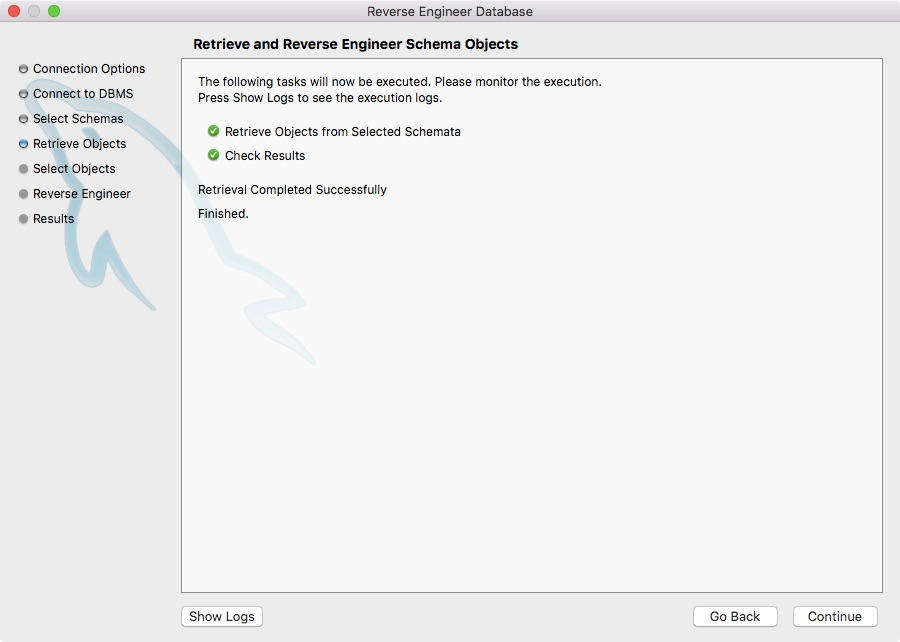
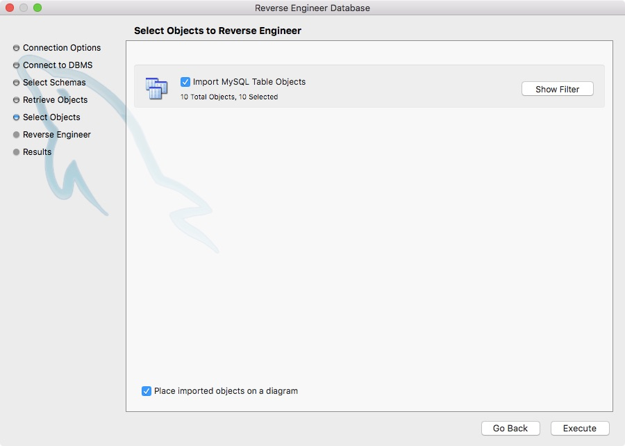
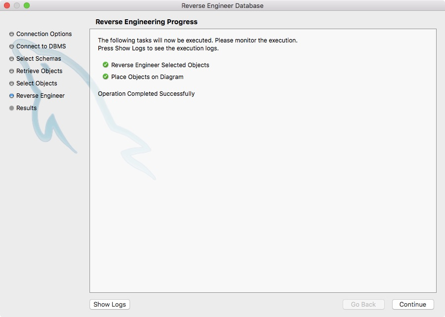
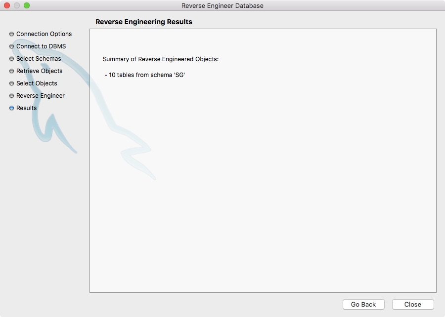
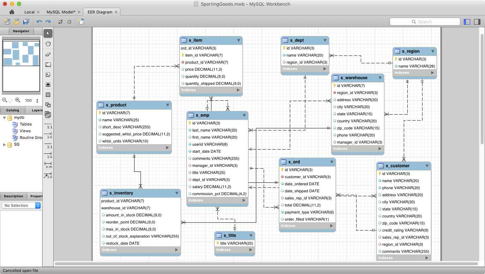

= Bases de datos - Importación de la base de datos Sporting Goods
Gestión Empresarial con Big Data - Nivel I. Universidad de Almería
:doctype: article
:encoding: utf-8
:lang: en
:toc: left
:numbered:

A partir del link:scripts/SG/SG.sql[script de inicialización de la base de datos Sporting Goods] podemos crear una base de datos MySQL sobre artículos deportivos. 

La creación de la base de datos la haremos desde MySQL Workbench en local. Para ello, una vez iniciado nuestro servidor MySQL local, estableceremos la conexión con dicho servidor. A continuación, ejecutaremos el script SG.sql que creará el esquema SG (Sporting Goods – Artículos deportivos) si no existe, e inicializará un conjunto de tablas con datos de ejemplo.

El siguiente paso será obtener el esquema de la base de datos de SG. Para ello, desde el menú `Database | Reverse Engineering` se iniciará un asistente que nos guiará en el proceso de importación de las tablas del esquema SG. 

A continuación se muestran los pasos que hay que seguir para crear el esquema:

1. Selección de la conexión al servidor MySQL
+

+
2. Conexión a la base de datos y recuperación de la información del servidor.
+
 
+
3. Selección del esquema al que hacer ingeniería inversa para obtener sus componentes. Seleccionaremos el esquema _SG_.
+

+
4. Recuperar la información de los objetos del esquema
+ 

+
5. Seleccionar los objetos a los que hacer ingeniería inversa. Importaremos todas las tablas del esquema.
+
 
+
6. Ejecutar la importación de objetos y colocarlos en el diagrama.
+
 
+
7. Ver los resultados de la importación.
+
 
+
Una vez finalizada la importación, aparecerán todas las tablas importadas en el diagrama. Las moveremos y las distribuiremos adecuadamente sobre el diagrama. 
+

+
Una vez definidas las relaciones, tendremos disponible el diagrama de la base de datos SG y podremos realizar las consultas más fácilmente.