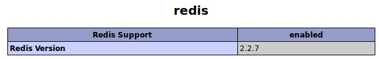
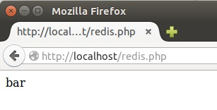

# Instalación del driver PhpRedis

En Linux y Mac OS X el driver está disponible en forma de código fuente en el [repositorio GitHub del proyecto PhpRedis](https://github.com/nicolasff/phpredis), por lo que tendremos que descargarlo y compilarlo. Este driver está escrito en C. 

Aquí seguiremos la instalación en un sistema Ubuntu Linux con una pila LAMP y Redis instalados previamente.

> Para Windows, se pueden seguir las instrucciones que aparecen en [PhpRedis](https://github.com/phpredis/phpredis) o podemos [descargar las dll de phpredis](http://char101.github.io/phpredis/).

Antes de descargar el código fuente de PhpRedis instalaremos el paquete `php5-dev`. Este paquete es necesario para compilar módulos PHP adicionales a partir de código fuente.

```
sudo apt-get install -y php5-dev
```

El código fuente del driver lo descargaremos a partir del [repositorio GitHub de PhpRedis](https://github.com/phpredis/phpredis)

```
cd ~
git clone https://github.com/phpredis/phpredis
```

Una vez descargado, compilaremos el código de PhpRedis

```
cd phpredis

phpize
./configure
make
sudo make install
```

Tras el proceso de instalación, se nos informará en qué carpeta se ha instalado el driver PHP para Redis en forma de extensión `redis.so`. La carpeta de instalación de la extensión se situará debajo de `/usr/lib/php5/`. En mi caso la extensión se ha instalado en `/usr/lib/php5/20121212`.

A continuación hay que modificar el archivo `php.ini` para indicar que cargue la extensión de PhpRedis (`redis.so`). `php.ini` se encuentra en `/etc/php5/apache2/php.ini`. Tendrás que añadir lo siguiente en la zona de extensiones.

```
extension=redis.so
```

> En sistemas Windows se añadirá a `php.ini` la extensión en forma de archivo `dll` (`redis.dll`).

Ahora, reiniciaremos el servidor Apache para que tengan efecto los cambios

```
sudo service apache2 restart
```

El código fuente de PhpRedis ya no lo necesitamos, por lo que lo podemos borrar. Nos situaremos sobre su carpeta superior y lo eliminaremos con 

```
cd ~
rm -rf phpredis
```

## Comprobación de la instalación de la extensión de Redis

Con `phpinfo()` podremos comprobar que efectivamente la extensión de Redis se carga sin problema en nuestro sistema.



## Comprobación del funcionamiento de la extensión de Redis

Para probar el funcionamiento del PhpRedis con Redis crearemos un script de prueba `redis.php` con los parámetros de conexión predeterminados. El script creará el valor `bar` en la clave `foo`. Recuerda que debes tener arrancado el servidor Redis.

```
sudo nano /var/www/html/redis.php
<?php
	$redis = new Redis();
	$redis->connect("localhost");
	$redis->set("foo", "bar");
	echo $redis->get("foo");
?>
```

