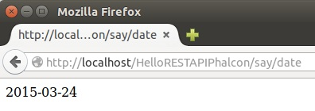
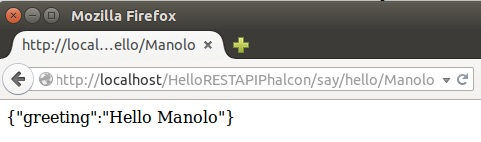
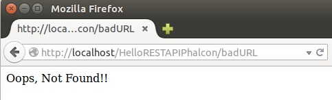

# Desarrollo de una API REST para Redis usando Phalcon

[Phalcon](http://phalconphp.com/en/) es un framework PHP open source que ofrece un alto rendimiento y un bajo consumo de recursos. Estas prestaciones se deben a que, a diferencia de otros frameworks, Phalcon se instala como una extensión C de PHP. Al ser una extensión de C:

* El framework se  carga cuando arranca el proceso daemon del servidor web. 
* Las clases y funciones proporcionadas por la extensión están disponibles para cualquier aplicación.
* El código del framework no tiene que ser interpretado ya que está compilado para la plataforma y procesador en el que corre.

Puedes [descargar Phalcon](http://phalconphp.com/en/download) en la zona de descargas de su web oficial. Allí están disponibles las descargas y las instrucciones de instalación para plataformas Linux, Mac, Windows, así como boxes Vagrant con entornos preconfigurados.

En este [breve tutorial de configuración de Phalcon](http://192.168.60.180/mtorres/ggvd2015/tree/master/Tutoriales/ConfiguracionEntornoGGVD#instalaci-n-del-framework-phalcon) puedes encontrar los pasos para configurar Phalcon en una plataforma LAMP.

## Proyecto básico API REST con Phalcon

Antes de ver cómo crear una API [REST](http://en.wikipedia.org/wiki/Representational_state_transfer) para Redis usando Phalcon, veamos primero cómo montar un ejemplo sencillo sin complicarnos con la base de datos. Concretamente se trata de crear una API REST con dos métodos GET. El primer método GET es un método básico, sin parámetros, que simplemente nos dice la hora actual. El segundo método GET saluda a la persona que se pase como parámetro.

Crearemos un proyecto denominado `HelloPhalcon`. Para nuestro ejemplo mínimo necesitaremos dos archivos:

* Un archivo `.htaccess` que contiene todas las reglas para reescribir las URLs que lleguen a nuestra aplicación.
* Un archivo `index.php` en el que iniciaremos Phalcon, definiremos las rutas permitidas y definiremos los *handlers* (funciones asociadas) para cada una de las rutas permitidas. 

Entonces, la estructura básica de nuestro proyecto sería:

```
HelloRESTAPIPhalcon /
	.htaccess
	index.php
```

Puedes [descargar este proyecto básico de API REST con Phalcon](https://gitlab.com/ualmtorres/HelloRESTAPIPhalcon) desde un repositorio en GitLab.

### El archivo `.htaccess`

El archivo `.htaccess` se usa para reescribir todas las peticiones que lleguen a nuestra aplicación. En concreto, todas las URL's se reescribirán hacia al archivo `index.php`, que será el que se encargue de implementar cómo dar respuesta a las peticiones permitidas por nuestra API.

Siempre utilizaremos el mismo archivo `.htaccess`. Por tanto, lo podremos copiar de proyectos anteriores.

<script src="https://gist.github.com/ualmtorres/c30c93c889c404e3ec36.js"></script>

### El archivo `index.php`

Con Phalcon podemos crear aplicaciones "Micro-Framework". Esto nos permite crear una aplicación PHP con muy poco código. Las aplicaciones Micro son adecuadas para implementar prototipos de una forma sencilla y APIs, éstas últimas el objetivo de este tutorial.

Para crear el archivo `index.php` de una API REST con `Phalcon` básicamente deberemos seguir cuatro pasos:

* Instanciar la clase `\Phalcon\Mvc\Micro()`, responsable de implementar la aplicación Micro.
* Añadir las rutas permitidas por nuestra aplicación, junto con su *handler* asociado. Las rutas son gestionadas internamente por Phalcon. Las rutas siempre deben comenzar por `/`. También incluiremos un método HTTP para indicar que sólo se atienda la petición para la ruta y el método HTTP indicados.
* Implementar los *handlers* de las rutas. Se trata de funciones que se ejecutarán cuando coincida la ruta.
* Atender la petición con el método `handle()` de la clase `\Phalcon\Mvc\Micro()`

#### Primeras líneas del archivo `index.php`
A continuación se muestra un archivo `index.php` que tomaremos como punto de partida. En él:

* Se instancia la clase `\Phalcon\Mvc\Micro()`, responsable de implementar una aplicación Micro.
* Se llama al método `handle()`, encargado de atender la petición que se ajuste a una de las rutas permitidas.

<script src="https://gist.github.com/ualmtorres/2b5d5d1494f4b3f4d53d.js"></script>

#### Definiendo las rutas y sus *handlers* en el archivo `index.php`

Nuestra API REST sólo atenderá las rutas que indiquemos. 

En nuestro caso sólo atenderemos dos rutas: `say/date`, que nos dice la fecha actual; y `/say/hello{name}`, que saluda a la persona que se pase como parámetro. 

A la ruta `say/date` le asociaremos una función denominada `currentDate()`. A la ruta `say/hello{name}` le asociaremos una función denominada `greeting($name)`. Ambas funciones se podrán implementar de forma anónima al declarar la ruta, o bien implementarlas aparte. En este tutorial las implementaremos aparte, ya que produce un código más legible.

<script src="https://gist.github.com/ualmtorres/67f5742a5374f9683641.js"></script>

La función `currentDate()` para este ejemplo sencillo se limita a mostrar la fecha actual

<script src="https://gist.github.com/ualmtorres/60c22547af1f50976fe8.js"></script>



Ahora veremos cómo pasar parámetros en una llamada a nuestra API. En nuestro ejemplo pasaremos un nombre a la ruta `say/hello{name}` para que la función `greeting($name)` salude a la persona con el nombre pasado como parámetro.

<script src="https://gist.github.com/ualmtorres/699cbb40b24b122956c5.js"></script>

Sin embargo, suele ser habitual que el resultado de una petición GET en una API REST sea una cadena JSON. En PHP la podemos construir creando un array para mostrarlo con la función `echo json_encode()`

<script src="https://gist.github.com/ualmtorres/4cd5ec28eb6f9bc3f1e0.js"></script>



#### Añadiendo un *handler* para rutas no encontradas

Un detalle que no debemos olvidar es qué debe mostrar nuestra aplicación cuando se solicita una ruta no válida. De forma predeterminada, dado que el control de las rutas lo ha tomado nuestro `index.php`, si no se encuentra una ruta, no se mostraría nada.

Si queremos informar de un error, nuestra aplicación tendrá que implementar un *handler Not Found* en el `index.php`.

<script src="https://gist.github.com/ualmtorres/805d418fcbd35693b88f.js"></script>



#### Por fin, nuestro archivo `index.php` preparado

<script src="https://gist.github.com/ualmtorres/aa3d8a258ed6e22881de.js"></script>

### Definición de la API

Una vez que hemos visto la técnica para crear una API REST básica PHP usando Phalcon, es importante comenzar el desarrollo de una API REST definiendo la API. En dicha definición se describirán los métodos HTTP permitidos. Para el ejemplo desarrollado tendríamos


|Método|URL|Descripción|
|------|---|-----------|
|GET|/say/date|Muestra la fecha actual|
|GET|say/hello/Manolo|Devuelve un saludo JSON a partir del nombre 'Manolo'|

### Descarga el código de este proyecto

Puedes [descargar el código del ejemplo básico de API REST con Phalcon](https://github.com/ualmtorres/HelloRESTAPIPhalcon) del repositorio de GitHub.

## Proyecto básico API REST para Redis con Phalcon

Aquí veremos cómo implementar una API REST para Redis con los métodos básicos: GET, POST, PUT y DELETE.

### Definición de la API

Para ilustrar la creación de una API REST para Redis usando Phalcon nos limitaremos a mostrar los cuatro ejemplos básicos:

* GET: Recuperar un valor a partir de una clave
* POST: Crear un nuevo par clave-valor
* PUT: Modificar el valor de una clave
* DELETE: Eliminar una clave

|Método|URL|Descripción|
|---|---|---|
|GET|/api/{key}|Devuelve el valor JSON a partir de la clave proporcionada|
|POST|api/|Crea el nuevo par clave-valor proporcionado|
|PUT|api/{key}|Modifica la clave especificada con el valor proporcionado|
|DELETE|api/{key}|Elimina la clave especificada|


### Ejemplo de uso

|Operación|Uso|
|---|---|
|SELECT|`curl -i -X GET http://appLocation/api/foo`|
|INSERT|`curl -i -X POST -d '{"key":"foo", "value":"bar"}' http://appLocation/api`|
|UPDATE|`curl -i -X PUT -d '{"value":"bar2"}' http://appLocation/foo`|
|DELETE|`curl -i -X DELETE http://appLocation/api/foo`|

### Estructura del proyecto

La estructura básica de nuestro proyecto sería:

```
HelloRedisRESTAPIPhalcon /
	.htaccess
	index.php
```

### El archivo `.htaccess`

El archivo `.htaccess` se usa para reescribir todas las peticiones que lleguen a nuestra aplicación. Comentamos anteriormente que siempre utilizaremos el mismo archivo `.htaccess`. Por tanto, lo podremos copiar de proyectos anteriores.

<script src="https://gist.github.com/ualmtorres/c30c93c889c404e3ec36.js"></script>

#### Definiendo las rutas y sus *handlers* en el archivo `index.php`

Nuestra API REST sólo atenderá las rutas siguientes:

<script src="https://gist.github.com/ualmtorres/c52866d2df67d4b89564.js"></script>

En el código anterior también se indican los *handlers* que se encargarán de atender cada petición.

El *handler* `home` se encarga de mostrar el uso de la API.

El *handler* `notFound` redirigirá la ejecución al *handler* `home`, y mostrará el uso de la API en caso de acceder a una URL no válida.

### Cuestiones de interés en el archivo `index.php`

* Cada función de la API que interactúe con la base de datos comenzará estableciendo una conexión con la base de datos y finalizará cerrando la conexión establecida.
* Las funciones que generan JSON, por ejemplo un GET, devuelven un array asociativo `array(clave => valor)`.
* Los parámetros de la petición HTTP son recogidos con el método `$app->request->getRawBody()` proporciondo por Phalcon. Dicho método contiene los datos leídos en forma de array asociativo.

### El archivo `index.php`

<script src="https://gist.github.com/ualmtorres/1d3a424a77b5692317e4.js"></script>

### Descarga el código de este proyecto

Puedes [descargar el código del ejemplo básico de API REST para Redis con Phalcon](https://github.com/ualmtorres/HelloRedisRESTAPIPhalcon) del repositorio de GitHub.
