# Usando GitLab

Utilizando las credenciales que te han proporcionado, en este tutorial veremos cómo usar GitLab como *Sistema de Control de Versiones*.

Lo primero que encontrarás es la pantalla de *Login*, donde tendrás que introducir tus credenciales.

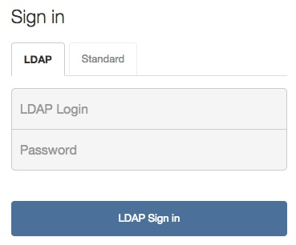

Si es tu primera sesión en GitLab accederás a la pantalla de Bienvenida. Verás que puedes crear proyectos y crear grupos. Además, recibes información sobre los proyectos públicos disponibles en el servidor.

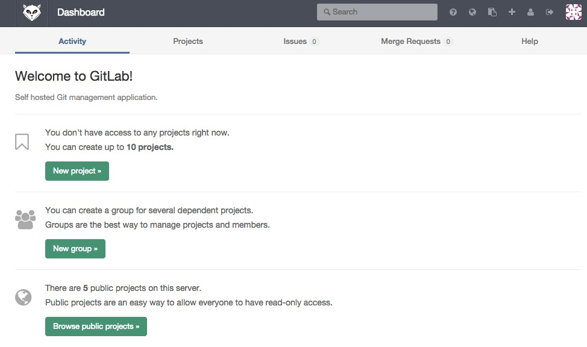

## Creación del proyecto de una asignatura

En primer lugar crearemos un proyecto nuevo para la asignatura. El criterio para denominar al proyecto será *Apellido1Apellido2NombreCompletoAsignaturaAño*, sin usar acentos. Por ejemplo, para *José María López Rodríguez* en la asignatura de *GGVD* de *2015* crearíamos *LopezRodriguezJoseMariaGGVD2015*.

El proyecto lo podemos crear desde la pantalla de bienvenida, pulsando el botón **New Project**

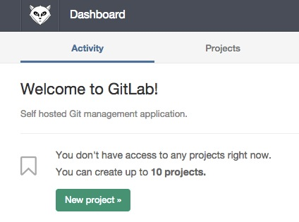

o bien pulsando el botón **+** de la barra de herramientas de la parte superior derecha.


En la pantalla de creación del proyecto, introduciremos el nombre del proyecto (p.e. *LopezRodriguezJoseMariaGGVD2015*) y estableceremos la visibilidad del proyecto. 

La visibilidad puede ser:

* Privada: Sólo es visible por el creador del proyecto y personas que hayan sido autorizadas.
* Interna: Es visible y clonable por el creador del proyecto y todos los usuarios registrados del servidor GitLab.
* Pública: Es visible y clonable por cualquier persona

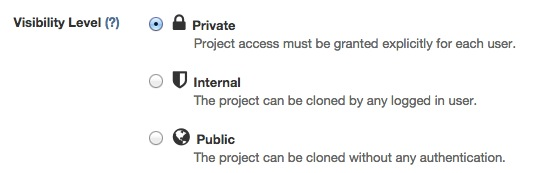

En nuestro caso, definiremos el proyecto con visibilidad *Interna*.

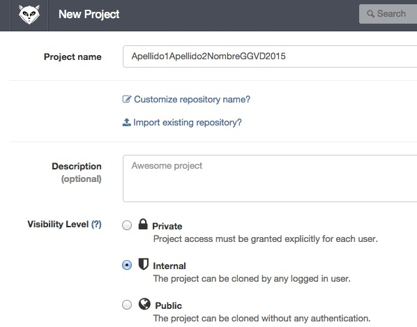

Una vez creado el proyecto, GitLab nos muestra las instrucciones para crearlo en local y vincularlo a este repositorio remoto (**Create Repository**), o bien para incoporar la referencia a un repo existente (**Existing Git Repo?**).

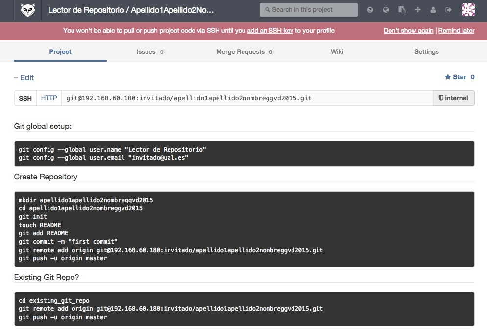

## Credenciales SSH

Si aún no tenemos subidas al servidor GitLab nuestras credenciales SSH, GitLab nos informará de ello. Sin ellas, no podremos hacer operaciones `push` ni `pull` por SSH.

A continuación se muestra como GitLab informa a nuestro usuario tras haber creado un proyecto que aún no tiene sus claves SSH en el servidor.


En los pasos 1 y 2 de [este enlace](https://help.github.com/articles/generating-ssh-keys/) se explica cómo crear una nueva clave SSH. El ejemplo es para GitHub pero la generación de claves SSH es independiente de ello.

Para crear una clave SSH asociada a nuestro email introduciremos en la consola 

```
$ ssh-keygen -t rsa -C <email>
```

A continuación se muestra un ejemplo para la creación de la clave SSH para `invitado@ual.es`

```
$ ssh-keygen -t rsa -C "invitado@ual.es"
Generating public/private rsa key pair.
Enter file in which to save the key (/home/ubuntu/.ssh/id_rsa): 
Created directory '/home/ubuntu/.ssh'.
Enter passphrase (empty for no passphrase): 
Enter same passphrase again: 
Your identification has been saved in /home/ubuntu/.ssh/id_rsa.
Your public key has been saved in /home/ubuntu/.ssh/id_rsa.pub.
The key fingerprint is:
...
```

Esto generará un par de claves (una pública `id_rsa.pub`, que es la que tenemos que subir  GitLab, y una privada `id_rsa`). Las claves se almacenarán en la carpeta `.ssh`.

Por tanto, con `cat ~/.ssh/id_rsa.pub` veremos nuestra clave pública.

```
$ cat .ssh/id_rsa.pub 
ssh-rsa XXXXXXXXXXXXXXXXXXXXXXXXXXXXXXXXXXXXXXX
XXXXXXXXXXXXXXXXXXXXXXXXXXXXXXXXXXXXXXXXX
XXXXXXXXXXXXXXXXXXXXXXXXXXXXXXXXXXXX invitado@ual.es
```

Copiaremos el contenido del archivo y lo pegaremos en la pestaña *SSH Keys* de nuestra cuenta en GitLab. (Puedes acceder a ella pulsando el icono **Profile Settings** de la barra superior.) Proporcionaremos un nombre a la clave para distinguirla de otras que pudiéramos tener registradas. Esto nos permite subir código a este servidor con identidades diferentes (imaginemos que firmanos de forma diferente los proyectos profesionales que los personales).

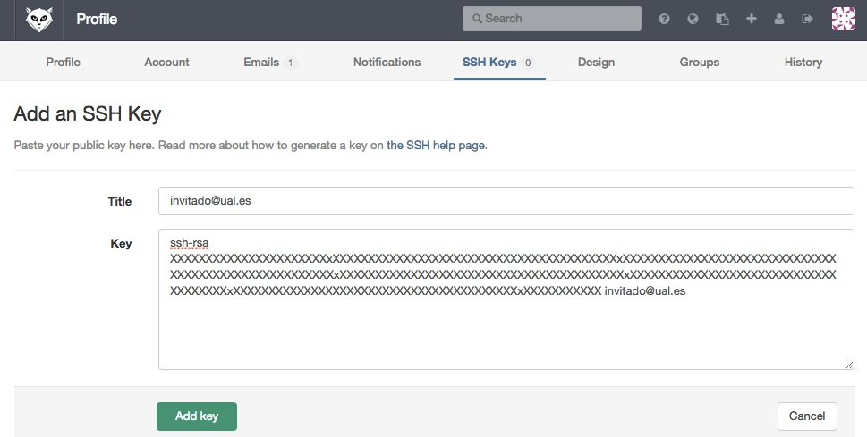

## Configuracion del usuario global Git

Los commits que hagamos a nuestro repo quedarán registrados a nuestro usuario. Para registrar un usuario en Git usaremos la orden `git config`.

Aunque es posible registrar varios usuarios, aquí sólo vamos a ver cómo registrar un usuario, el usuario global, que es el usuario predeterminado y al que quedarán vinculados todos los commits que hagamos.

```
git config --global user.name "Lector de Repositorio"
git config --global user.email "invitado@ual.es"
```

## Creación de nuestro repo local 

Hasta ahora sólo habíamos creado un proyecto/repositorio en el servidor GitLab. Sin embargo, aún no tenemos un repositorio en nuestro  ordenador. Al crear el repositorio remoto, GitLab nos ofrece dos opciones:

* Crear un repo local nuevo y vincularlo al repo remoto. 
* Enlazar un repo local existente con el repositorio remoto creado.


Para este ejemplo usaremos la primera opción.

Desde nuestra carpeta elegida para albergar nuestro proyecto (p.e. `Documents`) crearemos una carpeta para el proyecto nuevo con `mkdir`, entraremos en esa nueva carpeta con `cd` e incializaremos un repo Git con `git init`.

```
$ mkdir apellido1apellido2nombreggvd2015
$ cd apellido1apellido2nombreggvd2015
$ git init
```
Esto inicializará un repositorio Git local en la carpeta indicada.

```
Initialized empty Git repository in /home/ubuntu/Documents/apellido1apellido2nombreggvd2015/.git/
```

A modo ejemplo, para inicializar el repositorio, y para añadir el enlace al repositorio remoto, crearemos un archivo local, comenzaremos a hacerle control de versiones localmente y lo subiremos al repositorio remoto.

### Creación del archivo

```
$ touch README
```

### Añadir archivo al Index

```
$ git add README
```

### Hacer commit

```
$ git commit -m "first commit"
```

Tras hacer el commit local, Git nos informa que el commit se ha realizado con éxito

```
[master (root-commit) a90c48a] first commit
 1 file changed, 0 insertions(+), 0 deletions(-)
 create mode 100644 README
```

### Vinculación del repo local al repo remoto

Antes de poder subir los cambios locales al repo remoto, debemos inicializar nuestro repo local con una referencia al repo remoto. Esta operación sólo será necesario realizarla una vez.

```
$ git remote add origin git@192.168.60.180:invitado/apellido1apellido2nombreggvd2015.git
```

En el ejemplo anterior el repositorio local quedaría vinculado al repositorio remoto `apellido1apellido2nombreggvd2015.git` disponible en la cuenta `invitado` en la IP indicada.

### Subir cambios repo local al repo remoto

Tras haber inicializado el repo remoto al que queda vinculado nuestro repo local ya podremos subir los cambios. Lo haremos con `git push`:

```
$ git push -u origin master
```

Tras comprobarse la autenticidad de nuestro host y de nuestra clave SSH, se llevará a cabo la operación `push`.


```
Counting objects: 3, done.
Writing objects: 100% (3/3), 215 bytes | 0 bytes/s, done.
Total 3 (delta 0), reused 0 (delta 0)
To git@192.168.60.180:invitado/apellido1apellido2nombreggvd2015.git
 * [new branch]      master -> master
Branch master set up to track remote branch master from origin.
```

GitLab mostrará los cambios subidos en la zona de actividad del proyecto.

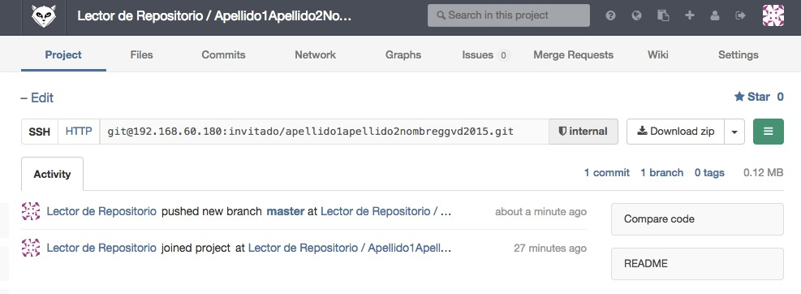

Los detalles de los cambios introducidos por nuestro commit se podrán ver seleccionando el commit correspondiente.

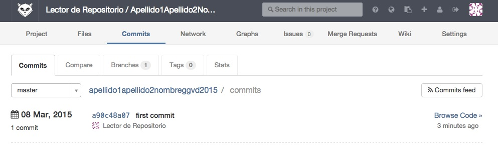

## Funcionamiento de aquí en adelante

El trabajo desarrollado en la asignatura quedará almacenado en nuestro repo. Organizaremos el proyecto de la asignatura por carpetas, con una carpeta para cada el material de cada sesión (`SesionXX`).

Un ejemplo de funcionamiento para la sesión 00 podría ser:

```
$ mkdir Sesion00
$ cd Sesion00
$ --- Trabajo ---
$ P.e. echo "Comenzando la asignatura..." > primerDia.txt
$ --- Fin trabajo ---
```

Una vez finalizado el trabajo podemos conocer las discrepancias entre los archivos de nuestro proyecto, el *Index* de Git y el repositorio. Lo haremos con `git status`. Esto debe mostrar todos los cambios realizados.

### Añadir los cambios al `Index`

```
$ git add .
```

### Hacer commit al repo local

```
$ git commit -m "Sesion 01"

[master 722d4f8] Sesion 01
 1 file changed, 1 insertion(+)
 create mode 100644 Sesion00/primerDia.txt
```

### Hacer push al repo remoto

```
$ git push 

Counting objects: 5, done.
Compressing objects: 100% (2/2), done.
Writing objects: 100% (4/4), 360 bytes | 0 bytes/s, done.
Total 4 (delta 0), reused 0 (delta 0)
To git@192.168.60.180:invitado/apellido1apellido2nombreggvd2015.git
   a90c48a..722d4f8  master -> master
```

Ahora los cambios estarán visibles en el repo remoto

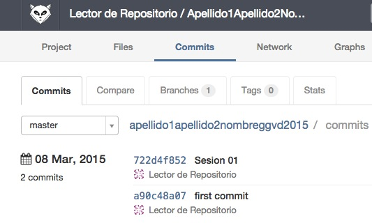

Si hacemos clic sobre el commit veremos su contenido

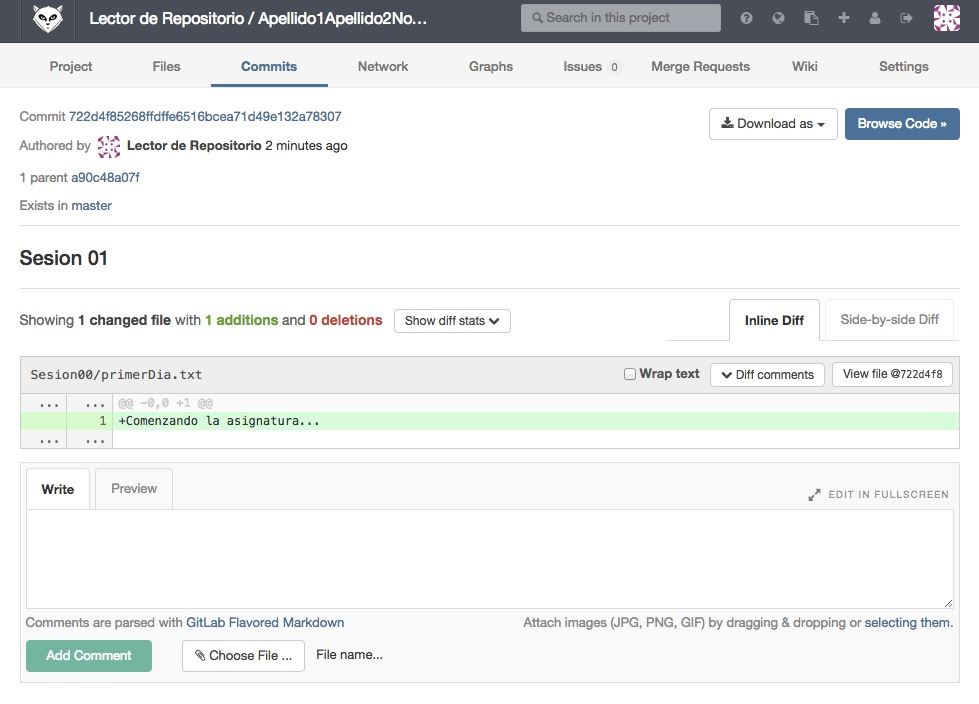

Y con esto ya habríamos subido el trabajo de nuestra sesión al repositorio.


