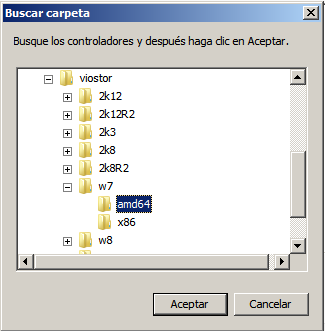

# Creación de una imagen Windows 7 para OpenStack

A menudo necesitamos en OpenStack disponer de imágenes diferentes de las que suelen estar disponibles en la red, las cuales suelen ser distribuciones de Linux en su versión servidor. 

Sin embargo, si necesitamos instancias Windows en OpenStack sólo encontramos la preparada por Cloudbase para Windows Server 2012.

En este tutorial veremos cómo crear una imagen OpenStack para Windows 7. A grandes rasgos el proceso consiste en crear en nuestro ordenador una máquina virtual configurada para funcionar en OpenStack. A continuación, convertiremos la máquna virtual a formato qcow2. Finalmente, subiremos la imagen qcow2 a OpenStack.

Necesitaremos:

* Una imagen de Windows 7
* Ubuntu Virtual Manager
* [Drivers VirtIO para Windows](https://fedoraproject.org/wiki/Windows_Virtio_Drivers#Direct_download)

## Paso 1. Crear máquina virtual Windows 7

### Especificar los parámetros de la máquina virtual

Desde Virtual Manager pulsaremos el botón _Crear una máquina virtual nueva_ 


Aparecerá un asistente que iremos siguiendo para crear la máquina virtual. En el primer paso introduciremos el nombre de la máquina virtual, _Windows7_. Dejaremos el resto de valores predeterminados y pasaremos al paso siguiente.


En el segundo paso pulsaremos el botón _Explorar_ para seleccionar la imagen ISO de nuestro Windows 7. En el desplegable _Tipo de SO_ seleccionaremos _Windows_ y en _Versión_ seleccionaremos _Microsoft Windows 7_. No obstante, esta información no es relevante. 


En el tercer paso, aumentaremos la memoria RAM a 2048 MB. El resto de valores predeterminados los mantendremos y pasaremos al paso siguiente.


En el cuarto paso se especifica el tamaño que va a tener el disco en la máquina virtual. Elegiremos un tamaño de 20 GB y muy importante: **Dejaremos desactivada la casilla de verificación _Asignar todo el disco ahora_**. Eso proporcionará dos ventajas:

* El tamaño inicial de la imagen Windows 7 en OpenStack será de unos 4 GB y no 20GB.
* El tamaño de las instancias que se creen más adelante a partir de la imagen de Windows 7 en OpenStack vendrá determinada por las caracterísitcas del _flavour_ elegido, y no estará condicionado por los 20 GB especificados a la hora de crear la máquina virtual.


En el último paso del asistente activaremos la casilla de verificación _Personalizar configuración antes de instalar_. Esto nos permitirá lo siguiente:

* Especificar el controlador VirtIO para el disco 
* Especificar el controlador VirtIO de la tarjeta de red.
* Añadir una unidad de CD en la que cargaremos el ISO con los controladores VirtIO.


Para configurar el disco, lo seleccionaremos de la lista de la izquierda y desplegaremos las _Opciones avanzadas_. En _Bus de disco_ seleccionaremos _Virtio_ y pulsaremos en botón _Aplicar_.


De forma análoga, seleccionaremos la tarjeta de red de la lista de la izquierda. En la lista _Modelo de dispositivo_ seleccionaremos _Virtio_ y pulsaremos el botón _Aplicar_.


Para añadir una unidad de CD donde cargaremos los drivers VirtIO pulsaremos el botón _Añadir hardware_. En este formulario realizaremos varios cambios:

* Seleccionaremos _Storage_ de la lista de la izquierda.
* Marcaremos el botón de opción _Seleccione un almacenamiento gestionado o de otro tipo existente_.
* Pulsaremos el botón _Explorar_ y seleccionaremos el ISO de los controladores VirtIO. Los podemos descargar desde [Windows VirtIO Drivers de Fedora Project](https://fedoraproject.org/wiki/Windows_Virtio_Drivers#Direct_download).
* En _Tipo de dispositivo_ seleccionaremos _CDROM IDE_.


### Instalación de Windows 7 usando los controladores VirtIO

Una vez finalizada la configuración de creación de la máquina virtual, pulsaremos el botón _Iniciar la instalación_. Tras unos instantes aparecerá la pantalla siguiente en la que aparecerán el idioma de la instalación, el formato de hora y moneda, y el teclado. Dejaremos los valores predeterminados de _Español_.


Ahora procederemos con la instalación de Windows y dejaremos los valores predeterminados. 

En la pantalla de _¿Qué tipo de instalación desea?_ seleccionaremos _Personalizada (avanzada)_.


En el paso siguiente observamos que la máquina virtual aún no tiene ningún disco. 


A continuación cargaremos el controlador VirtIO. Para ello pulsaremos sobre _Cargar controlador_. Nos aparecerá un cuadro de diálogo pidiéndonos que indiquemos dónde está el controlador.


Pulsaremos sobre el botón _Examinar_. En el cuadro de diálogo aparecerán dos unidades de CD. La primera es la que tiene la imagen de Windows 7 que se ésta instalando. La segunda es la que tiene los controladores VirtIO que necesitamos propocionar en este paso. Los controladores de disco están en la carpeta `viostor/w7/amd64`. 



Tras seleccionar el controlador de disco de VirtIO en el cuadro de diálogo aparece el controlador disponible.


Ahora veremos que ya sí aparecen los 20 GB de espacio de disco que seleccionamos en Virtual Manager cuando estábamos creando la máquina virtual de Windows 7. Pulsaremos el botón _Siguiente_ y comenzará el proceso de instalación de Windows 7.


Una vez finalizada la instalación de Windows, hay que especificar el nombre de usuario y el del equipo. A modo de ejemplo usaremos _cloud_user_ y _cloud_PC_, este valor se deja a discrección.

En cuanto al número de serie, no introduciremos ninguno para que nuestro número de serie no sea el que se utilice a la hora de crear instancias OpenStack. Al dejar la instalación sin número de serie, se pedirá al inicio de cada sesión y será responsabilidad de los usuarios de la instancia OpenStack introducir un número de serie válido (p.e. disponible a través del acuerdo Dreamspark).

Además, desactivaremos la casilla de verificación _Activar Windows automáticamente cuando esté conectado_. A continuación, pulsaremos el botón _Omitir_


En el la pantalla de _Ayude a proteger el equipo y a mejorar Windows automáticamente_ seleccionaremos _Preguntar más tarde_. En el resto de ventanas dejaremos los valores predeterminados.


A continuación vamos a actualizar los controladores que quedan pendientes, como el de red, y el _Balloon_ de aprovechamiento de RAM. Para ajustar estos controladores, iremos al _Panel de control_ y en el bloque _Hardware y Sonido | Dispositivos e impresoras_ seleccionaremos _Administrador de dispositivos_. 


Veremos como en la categoría _Otros dispositivos_ aparecen como pendientes de configurar _Controladora Ethernet_ y _Dispositivo PCI_.


Para actualizar sus respectivos controladores, haremos clic sobre ellos con el botón derecho, seleccionaremos _Actualizar software de controlador_ y en la pantalla siguiente seleccionaremos _Buscar software de controlador en el equipo_.


Los controladores necesarios están en el CD de VirtIO. Lo seleccionaremos pulsando sobre _Examinar_ y eligiendo la unidad de CD en la que tenemos los controladores VirtIO.


Aparecerá un cuadro de diálogo preguntando si queremos instalar el controlador de red de VirtIO. Marcaremos la casilla de verificación _Siempre confiar en el software de "Red Hat, Inc."_ y pulsaremos el botón _Instalar_.


Aparecerá un cuadro de diálogo informándonos que el controlador ha sido instalado correctamente. Repetiremos estos pasos para el _Dispostivo PCI_. Tras esto, todos los disposivos de nuestra máquina virtual están configurados correctamente. 

### Configurar MTU (Sólo en Windows 7)

La Unidad Máxima de Transferencia (MTU) expresa el tamaño en bytes de la unidad de datos más grande que puede enviarse usando un protocolo de comunicaciones. Un tamaño MTU no adecuado puede derivar en la fragmentación y pérdida de paquetes.

De forma predeterminada, Windows 7, tiene establecido el tamaño en 1500. Esto provoca que nuestra máquina virtual experimente problemas de conexión a Internet. El valor adecuado MTU que debemos especificar es 1432. Veamos cómo hacerlo.

**Abrir como Administrador** una ventana de <i>Símbolo del sistema</i>. Introducimos `netsh interface ipv4 show interfaces` para conocer la lista de tarjetas de red disponibles en la máquina virtual. En el ejemplo vemos que la que tenemos que configurar la de índice 11, que es la que tiene MTU a 1500.


Para cambiar la MTU y hacer el cambio persistente, escribiremos `netsh interface ipv4 set subinterface <indice> mtu=1432 store=persistent`. En nuestro caso el valor de índice es `11`. La interfaz de comandos devolverá _Aceptar_ si el cambio se ha llevado a cabo con éxito.

Por último, configuraremos la red, añadiendo la dirección de un DNS, y apagaremos la máquina virtual.

### Desconectar las unidades de CD de la máquina virtual

Lo siguiente que haremos será desconectar las unidades de CD de la máquina virtual, tanto la que tiene la imagen de Windows 7, como la que tiene los controladores VirtIO, ya que no queremos que formen parte de la imagen que vamos a generar para OpenStack. Para ello, pulsaremos el botón _Mostrar detalles del hardware virtual_ de _Virtual Manager_. Seleccionaremos la primera unidad de CD y pulsaremos el botón _Desconectar_


Repetiremos este paso para la unidad de CD de VirtIO.


## Paso 2. Instalar Cloudbase-init

Iniciamos la máquina virtual para instalar Cloudbase-init. Cloudbase-init permite la inicialización automática de las instancias OpenStack. Se encarga de tareas como expansión del volumen del disco, creación de usuarios, generación de passwords, entre otros. Una vez instalado, se habrá creado un archivo de configuración y un servicio de Windows que se ejecuta al inicio. [Descarga Cloudbase-init x64](https://cloudbase.it/cloudbase-init/#download).


En la instalación de Cloudbase-init aceptaremos los valores predeterminados salvo en la especificación del nombre de usuario. Aquí indicaremos nuestro usuario Windows, y debe coincidir con uno existente. En el caso de este tutorial usaremos _cloud-user_.


Al finalizar el asistente, nos pedirá que si queremos ejecutar `sysprep` para crear una imagen generalizada, y que al crear instancias sobre ella, el nuevo usuario la configure con sus propias preferencias. **No marcaremos esta opción por ahora. Haremos `sysprep` más adelante**.


Cloudbase-init creará un archivo de configuración almacenado en `C:\Archivos de programa\Cloudbase Solutions\Cloudbase-Init\conf\cloubase-init.conf\`.

<script src="https://gist.github.com/ualmtorres/6adbf12942a2a4dec461.js"></script>

## Paso 3. Desactivar el cortafuegos y activar conexiones de escritorio remoto

Para poder conectarnos más adelante por escritorio remoto a la instancia de Windows 7 de OpenStack, hay que desactivar el cortafuegos de Windows y permitir la conexión por escritorio remoto.

El cortafuegos lo desactivaremos desde el bloque _Sistema y seguridad >> Firewall de Windows_ del _Panel de control_.


El escritorio remotolo desactivaremos desde el bloque _Sistema y seguridad >> Sistema_ del _Panel de control_. En este caso, marcaremos la opción _Permitir la conexiones desde equipos que ejecuten cualquier versión de Escritorio remoto (menos seguro)_.


## Paso 4. Activar `sysprep`

`sysprep` prepara la imagen para la duplicación. De esta forma, cuando creemos una instancia a partir de esta imagen, aparecerá la Bienvenida de Windows. 

Desde la ventana de _Símbolo de sistema_ ejecutaremos `C:\Windows\System32\sysprep\sysprep.exe /generalize /oobe /shutdown`


## Paso 5. Subir la imagen a OpenStack

En este paso convertiremos la imagen creada a formato qcow2 y la subiremos a OpenStack. En primer lugar, en nuestro equipo Linux convertiremos la imagen de Windows 7 al formato qcow2, y la comprimiremos usando el parámetro `-c`. Esto dismuinirá el tiempo de propagación a los nodos de cómputo a la hora de instanciar. Es cierto, que al estar comprimida la imagen aumentarán los requerimientos de CPU a la hora de crear las imágenes, pero en nuestro caso, las ventajas superan los inconvenientes.

Para ello, ejecutaremos lo siguiente:

```
# qemu-img convert -c -p -f raw -O qcow2 /var/lib/libvirt/images/win7.img ./win7.qcow2
```

Una vez convertida la imagen la copiaremos al nodo de control de OpenStack y desde él subiremos la imagen a OpenStack con el comando siguiente:

```
# glance --os-image-api-version 1 image-create --name="Windows 7 (x86_64)" --is-public=True --container-format=bare --disk-format=qcow2 --file=/home/mtorres/Windows7.qcow2
```

Tras esto la imagen subida a OpenStack ya está disponible y lo podemos comprobar desde Horizon. La imagen está lista para ser instanciada. 


## Paso 6. Creación de la instancia de Windows 7

En primer lugar, creamos una instancia a partir de la imagen de Windows 7 subida a OpenStack completando los valores como el nombre de la instancia, _flavour_, número de instancias, y red. Por supuesto, el puerto 3389 para RDP deberá estar abierto para que la instancia admita conexiones de escritorio remoto.


Una vez finalizada la creación de la instancia, asignaremos una IP pública, pero comprobaremos que no es posible conectarnos a la instancia por escritorio remoto. Esto se debe a que como pasamos `sysprep` antes de convertirla a qcow2 y subirla a OpenStack, la instancia está ejecutándose pero aún está en la pantalla de configuración de la instalación de Windows, por lo que aún no es accesible por Escritorio remoto. Por tanto, tendremos que conectarnos a ella a través abriendo una consola desde OpenStack. Una vez abierta la consola, efectivamente comprobamos que la instancia está ejecutándose y está esperando a terminar de ser configurada antes de estar disponible a través de escritorio remoto.


Ahora tendremos que crear una cuenta de usuario (p.e. _mtorres_), introducir un número de serie, y seguir todos los pasos habituales de la instalación de Windows.

La figura siguiente ilustra la pantalla inicial de login, en la que aparece la cuenta de usuario _cloud-user_, creada en la instalación de la máquina virtual, y la creada ahora desde la consola, _mtorres_.


Una vez finalizada la configuración inicial, ya sí podemos establecer una conexión por escritorio remoto usando la IP flotante que haya asignado OpenStack a esta instancia. La figura siguiente ilustra la conexión a la instancia con el Cliente de escritorio remoto de Microsoft.


> **CONSEJO:** El tema _Basic_ predeterminado ofree retardos en el refresco de pantalla a través de la conexión de escritorio remoto. El uso de un tema menos exigente, como _Classic_ permite tener una interacción más fluida. Puedes cambiarlo en el _Panel de control_.

## Paso 7. Eliminación del número de serie

Si pensamos distribuir la imagen que hemos creado, debemos saber que incluirá el número de serie de Windows 7 que se haya usado en el instalador. En nuestro caso, el propio instalador de Windows 7 lo ha incorporado. Por tanto, es conveniente eliminar dicho número de serie, crear un _snapshot_ a partir de la instancia sin número de serie, y que sea el _snapshot_ creado el nuevo medio para crear instancias.

Primero, debemos consultar el número de serie. Para ello, como abriremos una ventana de Interfaz de comandos y escribiremos lo siguiente para obtener el número de serie: 

```
slmgr /dlv
```

Esto mostrará un cuadro de alerta con el número de serie en _Id. de activación_. 

Para eliminar el número de serie escribiremos el comando siguiente:

```
slmgr /upk <<clave>>
```

A continuación, ya podremos hacer el _snapshot_. Al instanciar este snapshot e iniciar sesión, se le pedirá al usuario que introduzca un número de serie válido.

