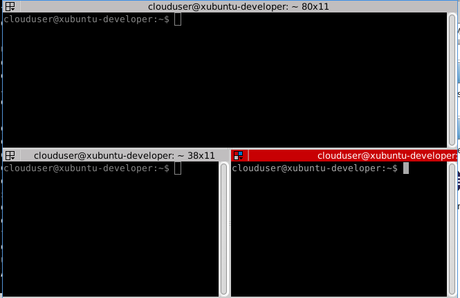

# Creación de una imagen OpenStack para desarrollo con XUbuntu

Las imágenes Openstack de Linux que suelen estar disponibles suelen ser distribuciones de Linux en su versión servidor. Pero a veces es necesario contar con una imagen de Linux con una interfaz gráfica instalada.

En este tutorial veremos cómo crear una imagen OpenStack sobre Ubuntu para desarrollo en Java y Python. La forma de conectarnos a las instancias que lancemos a partir de esta imagen será a través de RDP, lo que nos permitirá conectarnos desde Microsoft Windows y desde Mac con el cliente Microsoft de escritorio remoto. A grandes rasgos el proceso consiste en configurar el servidor XRDP e instalar las herramientas de desarrollo necesarias.


## Paso 1. Crear la instancia básica

Comenzaremos siguiendo los pasos habituales para la creación de la instancia en OpenStack, como son la selección del _Flavour_, imagen de partida y demás. Elegiremos un _flavour_ personalizado creado previamente por el administrador, el cual consta de 2 VCPU, 2 GB de RAM y 15 GB de HD. 

> No olvides que nos conectaremos a la instancia vía RDP. Por tanto, en las reglas de acceso y seguridad debe haber un grupo de seguridad que permita la conexión vía RDP (puerto 3389)

Según la configuración de tu proyecto OpenStack, quizá tengas que asignar una IP flotante a tu instancia.

### Actualización de paquetes e instalación del _Desktop_

Para la instalación básica de la instancia comenzaremos con los pasos habituales de `update` y `upgrade` para actualizar la lista de paquetes en nuestra instancia. A continuación, instalaremos el escritorio XUbuntu, que es sencillo, ligero y fácil de utilizar.

```
sudo apt-get update
sudo apt-get upgrade
sudo apt-get install xubuntu-desktop
```

### Creación de usuario

La instancia creada incluye al usuario _ubuntu_, el cual nos reservaremos para usarlo sólo desde consola. Para la conexión vía RDP creremos un usuario específico, al que denominaremos _clouduser_. Crearemos este usuario con `adduser` y completaremos a discrección la contraseña y los datos personales (p.e. _Full Name = Cloud User_)

```
sudo adduser clouduser
```

Una vez creado el usuario, le daremos a `clouduser` privilegios de administrador editando el archivo `/etc/sudoers`. En él incluiremos la línea siguiente en la zona _# User privilege specification_, tras el usuario `root`.

```
clouduser ALL=(ALL:ALL) ALL
```

## Paso 2. Configuración del servidor XRDP

La forma que utilizaremos para conectarnos al escritorio de nuestra instancia será mediante RDP. Esto nos permitirá utilizar el cliente de escritorio remoto de Microsoft, tanto en su versión Windows como en su versión Mac. Los usuarios de Linux podrán conectarse con cualquier cliente RDP disponible (p.e. [rdesktop](http://www.rdesktop.org/)).

La instalación del servidor RDP en nuestra instancia la realizaremos con 

```
sudo apt-get install xrdp
```

### Configuración del teclado español

Si pruebas a conectarte vía RDP a la instancia comprobarás que no podrás usar la mayoría los caracteres especiales. Esto se debe a que el teclado predeterminado que está usando es el americano. Por tanto, sustituiremos el archivo de configuración de teclado predeterminado por un archivo de teclado español.

Para cambiar al teclado español sigue estos pasos:

1. Crear una copia del archivo `/etc/xrdp/km-0409.ini` como `/etc/xrdp/km-0409.old` (`sudo cp /etc/xrdp/km-0409.ini /etc/xrdp/km-0409.old`)
2. [Descargar el nuevo archivo de teclado español](km-0409.ini) y sustititur el existente en la carpeta `/etc/xrdp` por este recien descargado.
3. Reiniciar el servidor RDP (`sudo service xrdp restart`)

## Configuración del inicio de sesión gráfica

A continuación tenemos que indicar que el usuario `clouduser` usará XFCE cuando inicie su sesión gráfica. Eso se configura en el archivo `/home/clouduser/.xsession` indicando que usará `xfce4-session`.

Este cambio lo haremos como el usuario `clouduser`. Nos conectaremos con

```
su clouduser
```
A continuación indicaremos que usará la sesión XCFE con este comando

```
echo xfce4-session > /home/clouduser/.xsession
```
Reinciaremos el servidor XRDP

```
sudo service xrdp restart
```
### Inicio de la sesión remota

Con nuestro cliente de escritorio remoto configuraremos una nueva conexión a la instancia. Al iniciar la conexión aparecerá una primera pantalla indicando que está intentando establecerse la conexión. En nuestro caso no se puede establecer la conexión aún, ya que no se han proporcionado credenciales de conexión.


Introduciremos las credenciales de `clouduser` en la ventana de inicio de sesión.


A continuación nos aparecerá la información de conexión.


Tras unos instantes aparecerá una ventana de Bienvenida. En ella selccionaremos la configuración predeterminada.


### Configuración del tabulador en la terminal gráfica

Si iniciamos una terminal de línea de comandos comprobaremos que la tecla _Tab_ no hace el autocompletar. Para solucionar este inconveniente haremos el siguiente cambio en el archivo `/home/clouduser/.config/xfce4/xfconf/xfce-perchannel-xml/xfce4-keyboard-shortcuts.xml`

Busca la línea

```
<property name=”&lt;Super&gt;Tab” type=”string” value=”switch_window_key”/>
```
y cámbiala por:

```
<property name=”&lt;Super&gt;Tab” type=”empty”/>
```

Reinicia tu sesión `clouduser` y verás como el comportamiento del tabulador ya es el esperado.

## Paso 3. Instalación de aplicaciones

* Oracle Java 8
* Eclipse


### Instalación de Oracle Java 8

Para instalar Oracle Java 8 tendremos que configurar un nuevo repositorio. Además, en el proceso de instalación aceptaremos los términos de la licencia de Oracle Java. Los comandos siguientes instalarán Oracle Java 8 en nuestra instancia:

```
sudo add-apt-repository ppa:webupd8team/java
sudo apt-get update
sudo apt-get install oracle-java8-installer
sudo apt-get install oracle-java8-set-default
```

Para comprobar que la instalación se ha llevado a cabo con éxito, escribiremos:

```
java -version

java version "1.8.0_66"
Java(TM) SE Runtime Environment (build 1.8.0_66-b17)
Java HotSpot(TM) 64-Bit Server VM (build 25.66-b17, mixed mode)
```

### Instalación de Eclipse

Instalaremos Eclipse desde la [Web oficial de Eclipse](http://www.eclipse.org). Entre las distintas distribuciones existentes descargaremos _Eclipse IDE for Java Developers (64 bits)_ para Linux. La instalación es un proceso muy sencillo en el que sólo hay que descomprimir el archivo descargado. 

Para organizar distintas distribuciones de Eclipse, crearemos una carpeta `eclipses` en el `home` de `clouduser`. En ella iremos creando carpetas para cada una de las distribuciones que queramos tener instaladas (_Mars, Luna, Kepler, ..._)

#### Instalación de PyDev

PyDev es un IDE Python para Eclipse. Básicamente los [pasos para instalar y configurar PyDev](http://www.pydev.org/manual_101_root.html) consisten en instalar PyDev en Eclipse y configurar el intérprete de Python.

Para instalar PyDev, en la ventana de _Instalar nuevo software_ añadiremos el sitio de PyDev `http://pydev.org/updates`.


En el asistente seleccionaremos todos los componentes, e iremos avanzando en el asistente aceptando los términos de uso.


Nuestra instancia dispone de un intérprete de Python 2.7. A continuación, configuraremos el intérprete de Python en PyDev. Para ello, en la ventana de _Preferencias_ seleccionaremos _PyDev | Interpreters | Python Interpreter_. La zona de intérpretes a la derecha aparecerá vacía. Para añadir el intérprete que tiene instalado nuestra instancia, basta con pulsar el botón _Quick Auto-Config_. Aceptaremos los cambios y al finalizar el proceso reinciaremos Eclipse.


## Instalación de Sublime Text 2

Sublime Text 2 es un editor de código muy extendido y sencillo de usar con sintaxis para gran cantidad de lenguajes de programación. 

[Descarga Sublime Text 2](http://www.sublimetext.com/2). La instalación sólo consiste en descomprimir el archivo descargado.

## Instalación de Git

Git es un sistema de control de versiones distribuido muy extendido. Lo instalaremos con 

```
sudo apt-get install git
```

## Otras herramientas de interés

### Terminator

_Terminator_ es una herramienta que nos permite tener varios terminales en una misma ventana dividiendo y organizando mejor la ventana de terminal.



Para instalarlo ejecuta estos comandos: 

```
Terminator
	sudo add-apt-repository ppa:gnome-terminator
	sudo apt-get update
	sudo apt-get install terminator
```

### htop

_htop_ es una herramienta que nos permite monitorizar nuestra instancia. Podremos ver el uso de las VCPUs, RAM y demás.


Para instalarlo ejecuta:

```
sudo apt-get install htop
```

### Ranger

_Ranger_ es un gestor de archivos de consola similar al _Finder_ de Mac OS X. Con su formato de columnas, nos permite desplazarnos fácilmente por los directorios y hacer una preview de los archivos de texto.


Para instalarlo ejecuta:

```
sudo apt-get install ranger
```

## Paso 4. Preparación de una instantánea a partir de la instancia

Esta instancia puede ser de gran utilidad para usarla en asignaturas de desarrollo. Por tanto, crearemos una instantánea a partir de esta instancia. 

Pero antes de proceder a crear la instantánea debemos ser conscientes que la clave pública de la persona que creó la instancia está disponible en el archivo `/home/ubuntu/.ssh/authorized_keys` del usuario `ubuntu`. Por tanto, dicha persona tendría podría entrar por `ssh` a cualquier nueva instancia que se crease a partir de la instantánea.

Si queremos evitar esto basta con editar el archivo 
`/home/ubuntu/.ssh/authorized_keys` y eliminar la entrada correspondiente.

Ahora sí podríamos crear la instantánea.

> También puedes borrar antes de crear la instantánea el historial del navegador de la instancia, así como borrar el contenido de los arhivos `~/.bash_history` de los usuarios `ubuntu` y `clouduser`.

